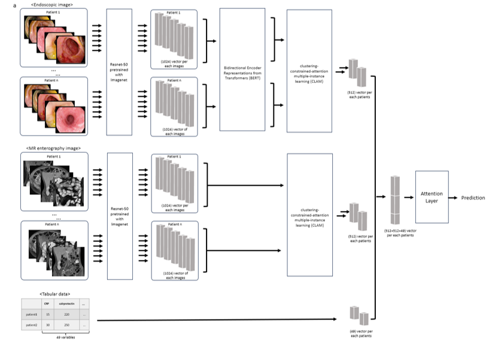
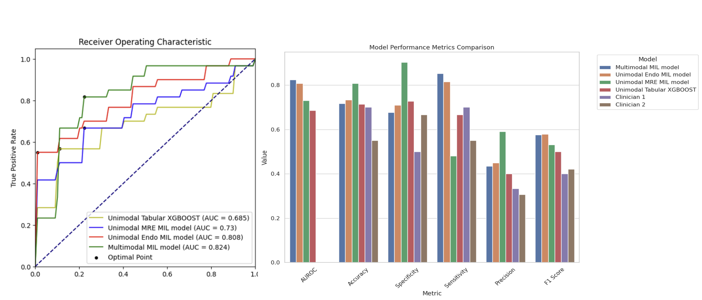
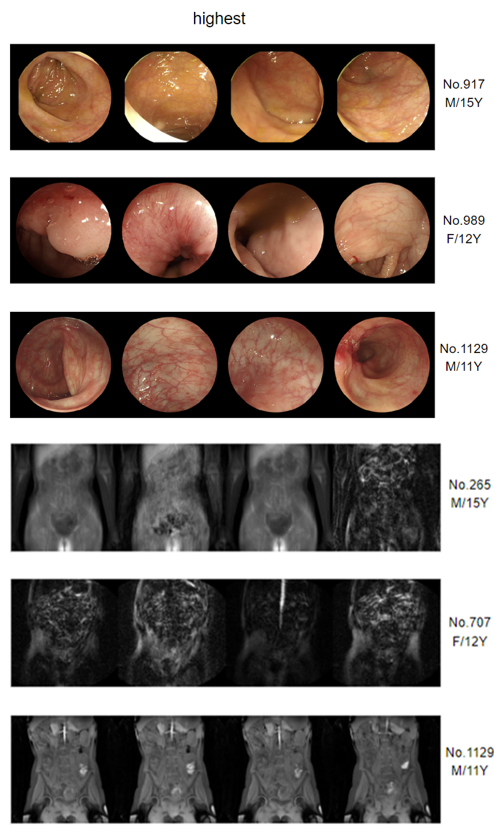

# MWMIL: Multimodal Weakly Supervised Multiple Instance Learning for Pediatric Crohn’s Disease

This repository contains the implementation of **MWMIL (Multimodal Weakly Supervised Multiple Instance Learning)**, a deep learning framework for predicting remission failure in **pediatric Crohn's disease** using **endoscopic images, MR enterography (MRE) images, and tabular clinical data**.

## Overview

Pediatric **Crohn’s disease (CD)** is a chronic inflammatory bowel disease that affects the entire gastrointestinal tract. Accurate **prognostic assessment** is essential for guiding treatment strategies. However, prior deep learning studies have focused primarily on **diagnosis and lesion segmentation**, rather than prognosis.

**MWMIL** addresses this gap by:
- **Fusing multimodal data** (endoscopic images, MRE images, and clinical data).
- **Applying weakly supervised multiple instance learning (MIL)** to handle unlabeled medical images.
- **Using clustering-constrained attention MIL (CLAM)** for feature extraction.
- **Outperforming unimodal models and clinicians** in remission failure prediction.



## Installation

Clone this repository and install dependencies:

```bash
git clone https://github.com/minkyoon/mwmil.git
cd mwmil
pip install -r requirements.txt
```

## Dataset Structure

Our dataset consists of **127 pediatric CD patients**, containing:
- **Endoscopic Images:** Preprocessed using ResNet-50 feature extraction.
- **MRE Images:** Processed via ResNet-50.
- **Tabular Clinical Data:** Includes 49 clinical parameters.


## Model Architecture


### Key Components:
1. **Feature Extraction:**
   - ResNet-50 extracts **1024-dimensional features** for each image.
   - Tabular data is normalized using Min-Max scaling.
  
2. **Clustering-Constrained Attention MIL (CLAM):**
   - Aggregates image-level features into **512-dimensional patient-level representations**.
  
3. **Multimodal Fusion:**
   - Combines **endoscopic (512D), MRE (512D), and tabular data (49D)**.
   - The final **attention layer** predicts remission failure.

## Training & Evaluation

Run the following command to train and evaluate the model:

```bash
python main.py --epochs 200 --device cuda:0
```

### Arguments:
- `--epochs`: Number of training epochs (default: `200`)
- `--device`: Device for training (default: `cuda:0`)

## Performance & Results

The model was evaluated using **10-fold cross-validation** on **127 pediatric CD patients**:
- **5,217** endoscopic images
- **181,497** MRE images
- **49 clinical parameters**

### **Receiver Operating Characteristic (ROC) Curve**


- **MWMIL AUROC: 0.824** (Higher than unimodal models)
- **MRE-based CLAM: 0.730**
- **Endoscopic CLAM: 0.808**
- **Tabular XGBoost: 0.685**

### **Model Performance Comparison**


| Model                        | AUROC | Accuracy | Sensitivity | Specificity | F1 Score |
|-----------------------------|------|----------|-------------|-------------|---------|
| **MWMIL (Ours)**           | **0.824** | **0.80** | **0.85** | **0.79** | **0.81** |
| **Unimodal Endo MIL**      | 0.808 | 0.75 | 0.78 | 0.72 | 0.74 |
| **Unimodal MRE MIL**       | 0.730 | 0.72 | 0.65 | 0.80 | 0.70 |
| **Unimodal Tabular XGBoost** | 0.685 | 0.68 | 0.60 | 0.75 | 0.66 |
| **Clinician 1**            | 0.70  | 0.65 | 0.72 | 0.55 | 0.68 |
| **Clinician 2**            | 0.65  | 0.60 | 0.50 | 0.65 | 0.58 |

## Citation

If you use this code or dataset, please cite:

```
@article{Jang2025MWMIL,
  title={Multimodal Weakly Supervised Multiple Instance Learning Model for Prediction of Remission Failure in Pediatric Crohn’s Disease},
  author={Jang S, Yoo MK, Lee EJ, et al.},
  journal={Pacific Symposium on Biocomputing},
  year={2025},
  volume={30},
  pages={1425 (poster)},
}
```


## Contact

For any questions, please contact:

- **Min Kyoon Yoo** - minkyoon_da@yonsei.ac.kr
